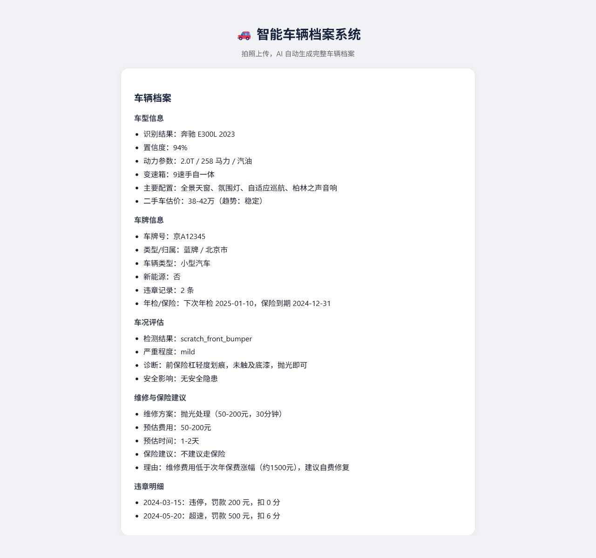

# 集成演示说明

本文档用于最后联调、答辩演示和录屏。当前系统支持两种运行方式：

- 本地演示模式：不配置 `DEEPSEEK_API_KEY`，Orchestrator 直接调用 A/B/C 三个 Agent 并生成车辆档案。
- LLM 调度模式：配置 `DEEPSEEK_API_KEY`，Orchestrator 使用 DeepSeek Function Calling 调度工具。

## 服务端口

| 服务 | 目录 | 端口 | 说明 |
| --- | --- | --- | --- |
| Agent A | `agent-a` | `8001` | 车型识别 |
| Agent B | `agent-b` | `8002` | 车牌识别 |
| Agent C | `agent-c` | `8003` | 车况检测 |
| Orchestrator | `orchestrator` | `8000` | 调度、报告生成、前端静态服务 |

## 快速启动

Windows PowerShell：

```powershell
.\scripts\start-demo.ps1
```

启动后浏览器访问：

```text
http://127.0.0.1:8000
```

停止服务：

```powershell
.\scripts\stop-demo.ps1
```

## 手动启动

分别打开 4 个终端。

Agent A：

```powershell
cd agent-a
python -m uvicorn api.main:app --host 127.0.0.1 --port 8001
```

Agent B：

```powershell
cd agent-b
python -m uvicorn api.main:app --host 127.0.0.1 --port 8002
```

Agent C：

```powershell
cd agent-c
python -m uvicorn api.main:app --host 127.0.0.1 --port 8003
```

Orchestrator：

```powershell
cd orchestrator
npm install
npm start
```

## 健康检查

```powershell
Invoke-RestMethod http://127.0.0.1:8001/api/vehicle/health
Invoke-RestMethod http://127.0.0.1:8002/api/plate/health
Invoke-RestMethod http://127.0.0.1:8003/api/damage/health
```

预期都返回：

```json
{
  "status": "ok",
  "model_loaded": false,
  "model_name": "..."
}
```

`model_loaded: false` 表示当前使用演示版模拟推理，接口和整合链路可正常演示。

## 端到端验证

一键验证完整本地演示链路：

```powershell
.\scripts\test-full-demo.ps1
```

预期输出：

```text
Full integration test passed in ... seconds.
```

PowerShell 请求：

```powershell
$body = @{
  image = [Convert]::ToBase64String([Text.Encoding]::UTF8.GetBytes("demo-image"))
  query = "帮我识别这辆车，生成完整车辆档案"
} | ConvertTo-Json

Invoke-WebRequest `
  -Uri http://127.0.0.1:8000/api/analyze `
  -Method POST `
  -ContentType "application/json" `
  -Body $body
```

预期 SSE 流程中包含：

- `recognize_vehicle`
- `detect_plate`
- `assess_condition`
- `query_plate_info`
- `check_violation`
- `query_vehicle_history`
- `diagnose_damage`
- `estimate_repair`
- `recommend_insurance`
- `report`
- `done`

查看存档：

```powershell
Invoke-RestMethod http://127.0.0.1:8000/api/archive
```

## 前端演示截图

截图文件：

```text
docs/demo-report.png
```



该截图由完整本地演示链路生成：Orchestrator 调用 Agent A/B/C 后写入存档，前端从历史档案进入详情页并渲染 Markdown 车辆档案。截图中可展示：

- 车型识别结果、置信度、动力参数和估价。
- B 模块输出的车牌号、归属地、蓝牌/新能源判断、违章和年检保险信息。
- C 模块输出的车况诊断、维修费用和保险建议。

## 性能验证

已在本地演示模式下连续调用 `POST /api/analyze` 5 次：

| 指标 | 结果 |
| --- | --- |
| 成功响应 | 5 / 5 |
| 最快响应 | 0.105 秒 |
| 最慢响应 | 0.179 秒 |
| 平均响应 | 0.125 秒 |
| 结论 | 满足总响应时间 < 15 秒 |

## 降级验证

验证单个 Agent 不可用时，系统仍能生成报告：

```powershell
.\scripts\test-degraded-demo.ps1
```

该脚本只启动 Agent A、Agent B 和 Orchestrator，并故意把 Agent C 指向不可用地址。预期输出：

```text
Degraded integration test passed.
```

此时报告仍会包含车型和车牌信息，并在风险提示里出现 `[DEGRADED]` 标记，说明部分服务不可用但系统已按可用信息降级生成档案。

## B 模块演示重点

答辩时可以强调：

- B 模块遵守统一 API 契约，Orchestrator 可直接调度。
- 车牌工具支持输入规范化，例如 `京A·12345` 会转为 `京A12345`。
- 蓝牌和新能源绿牌都可识别，例如 `京A12345`、`粤BDF5678`。
- 非法车牌会返回 HTTP 400，避免污染最终报告。
- 当前推理为可演示占位，真实模型可替换为 YOLOv8 检测 + PaddleOCR 识别，接口不需要改。

## LLM 调度模式

如需使用 DeepSeek Function Calling：

```powershell
$env:DEEPSEEK_API_KEY = "你的 API Key"
cd orchestrator
npm start
```

未设置 `DEEPSEEK_API_KEY` 时，系统自动进入本地演示模式，适合课堂展示和录屏。

## 常见问题

### npm install 在 Windows 上失败

当前 Orchestrator 只依赖 `express` 和 `cors`，不需要编译原生 SQLite 模块。若之前安装失败留下残留目录，可删除 `orchestrator/node_modules` 后重新执行：

```powershell
cd orchestrator
npm install
```

### PowerShell 显示 SSE 中文乱码

这是部分终端编码显示问题。浏览器访问前端通常正常；存档接口返回的是 UTF-8 JSON。
